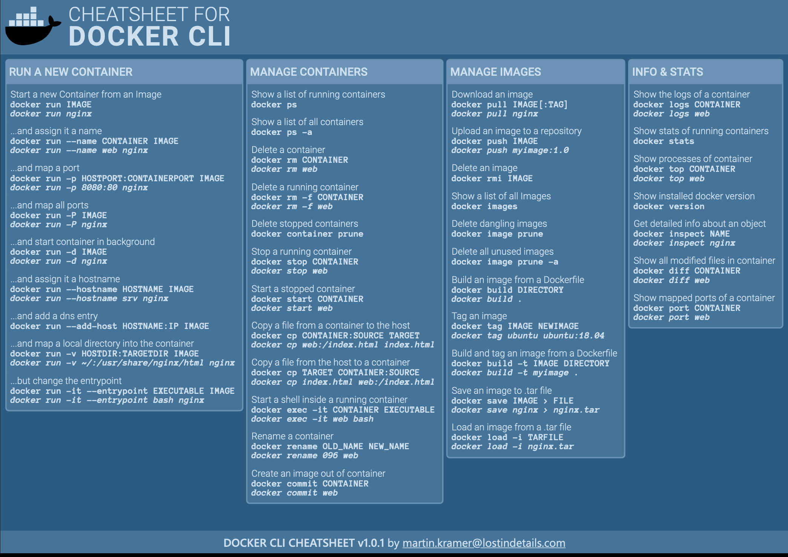

# Running Containers

## CheatSheet



## Running A Container

https://docs.docker.com/engine/reference/commandline/run/

- **Listing Containers**:

  - **Running**: `docker ps`
  - **Running & Stopped**: `docker ps -a`

- **Starting A New Container**: `docker run <image_name>` will start a container using an image matching the image name.

  > You can use the image names `busybox` or `` as useful blank template linux ones.

  - **Image Name**: The image name must match either a local image name (stored after a previous pull or image creation) or it will attempt to fetch from the docker registry. If no tag is provided it will default to `:latest` - e.g. `docker run busybox:latest` is the same as `docker run busybox`
  - **Container Id**: Each container has an id associated with the instance, which can be
  - **Naming**: A container name will be automatically generated unless an argument is provided for `-n` or `--name`.
  - **Port mapping**
    - Manual:
    - Automatic:
  - **Interactive Terminal**: Prepend

- **Same as `create` & `run`**: Under the hood, this is the same as running `docker create` & `docker run`

Full Example

```bash
docker run \
	busybox:latest

```

## Executing Commands

https://docs.docker.com/engine/reference/commandline/exec/

- **Executing commands in a Container**: `docker exec <container_id> [COMMAND]`
  - Interactive Mode: prepend `-it` to run the command interactively e.g.
  - Linux (mostly): Images inherit, or are based off of, a linux container. When running commands you are running in a linux environment and should keep that in mind when mapping indexes

## Container Lifecycle

- Stopping A Container
